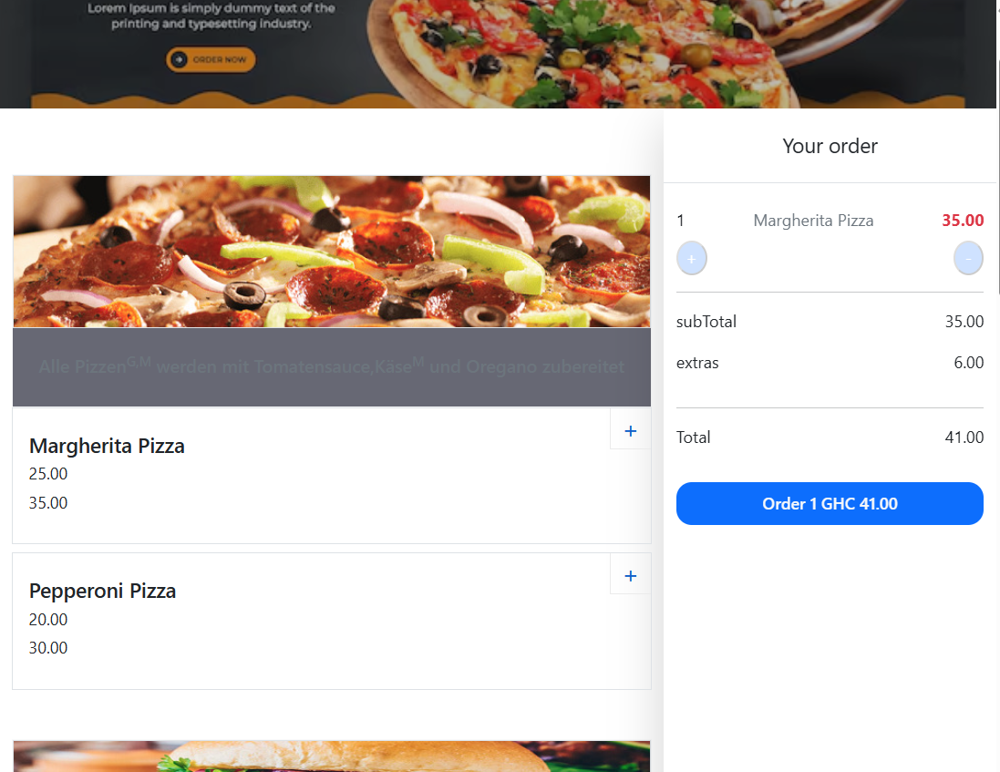
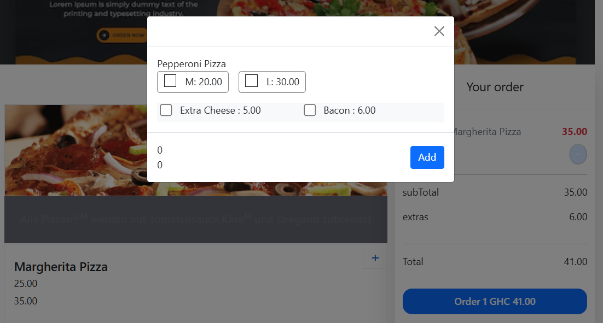

# PIZZA ORDERING APP

A dynamic pizza restaurant web app that displays categories and products with prices and sizes. Includes add to cart, remove, and quantity adjustment features. built with React JS, PHP and MySQL."

## MOTIVE

The goal of this project is to build a responsive and functional pizza restaurant web app that simplifies menu browsing and enhances the user experience with easy cart management. It sets the foundation for adding future features like order placement and payment integration.

## TECH STACK


## FEATURES

- View product categories (e.g., Pizza, Salad, etc.)
- Display products with sizes and dynamic pricing
- Add items to cart and manage quantities
- Remove items from cart
- Responsive UI with Bootstrap
- Backend API integration using PHP and MySQL

## SET UP

### 🔹 Frontend (React)

1. Clone the repository:
   ```bash
   clone the repo
   cd the repo
   ```
2. Install dependencies:

   ```bash
   npm install

   ```

3. Start the development server:
   ```bash
   npm start
   ```

### 🔹 Backend (PHP)

1. Set up a local php server

2. create and Update the database connection details in .env file

3. update fetch url in Context.js to match your php endpoint

### 🔹 Database (MYSQL)

1. Create your database (run sql file)

## Planned Features

- ordering functionality

- Integrated payment system.

- Delivery request and tracking

- Order history for users.

- Admin dashboard for managing orders

## SCREENSHOT




